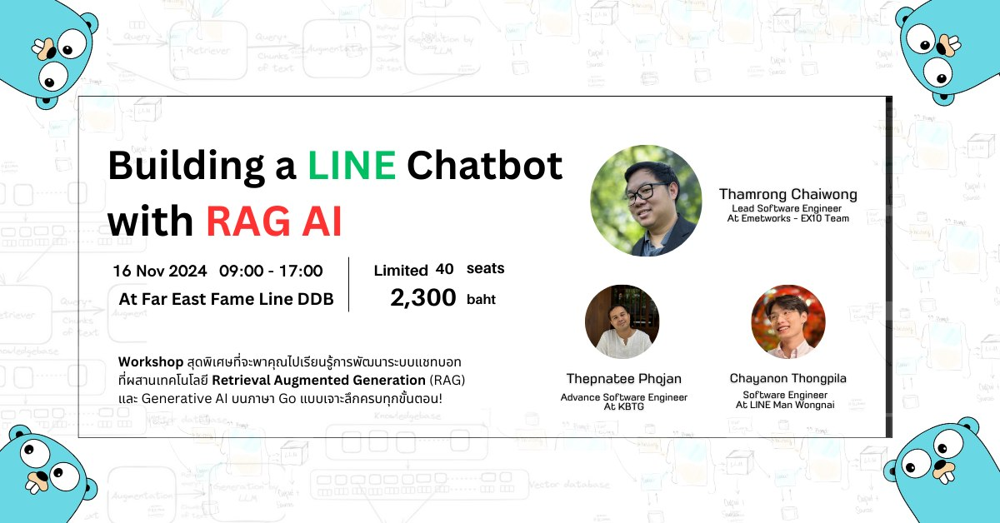

# ยินดีต้อนรับสู่ Workshop Building a LINE Chatbot with RAG AI using Golang

     

## 🎉 แนะนำตัว
ผู้สอน: ธำรงค์ ไชยวงค์ (โด้) 
ผู้ช่วยสอน: เทพนที โพธิ์จันทร์ (โอ๋) 
ผู้ช่วยสอน : ชญานนท์ ทองพิลา (นัชชี่) 

ยินดีต้อนรับเข้าสู่ **Building a LINE Chatbot with RAG AI using Golang**!

พวกเรารู้สึกตื่นเต้นที่ได้มีโอกาสมาพบกันในวันนี้ เพื่อนำเสนอการใช้งานเทคโนโลยีที่น่าตื่นเต้นจาก LINE ร่วมกับ AI และ Go!

ในวันนี้ เราจะสำรวจว่า Retrieval-Augmented Generation (RAG) สามารถเสริมพลังให้กับ AI ได้อย่างไร พร้อมกับการใช้งานภาษา Go ที่ได้รับการออกแบบมาเพื่อประสิทธิภาพสูงและความง่ายต่อการพัฒนา

## 🗓️ สิ่งที่คุณจะได้พบ

ใน Workshop วันนี้เราจะครอบคลุมหัวข้อต่าง ๆ ดังนี้:

### รายละเอียดหลักสูตร :

👉 `Introduction & Overview`
ทำความเข้าใจภาพรวมของภาษา Go และการใช้งานในโครงการขนาดใหญ่
การตั้งค่าและติดตั้งโปรเจค Go
พื้นฐานโครงสร้างโปรแกรมและ syntax ที่สำคัญใน Go
👉 `Initial Project Setup`
เริ่มต้นการพัฒนาโปรเจคและการตั้งค่า Environment
เชื่อมต่อบอทกับ LINE Messaging API
ใช้ Ngrok เพื่อเปิดเผย API Server ให้เข้าถึงจาก LINE

👉 `Introduction to Pinecone for RAG`
ทำความรู้จักกับ Pinecone และการใช้งานกับระบบ RAG
การจัดเก็บข้อมูลเวกเตอร์ด้วย Pinecone

👉 `Integrating OpenAI for AI Responses`
เชื่อมต่อกับ OpenAI API เพื่อสร้างบอทที่ตอบคำถามโดย AI
การปรับแต่งบอทให้โต้ตอบแบบอัจฉริยะโดยผสาน AI และ RAG
🎁 Demo Deployment Session
สรุปขั้นตอนการ Deployment สำหรับต่อยอดงานจริง 🔥
🍺 Networking

✅ สิ่งที่ผู้เรียนจะได้รับ:
LINE Chatbot ที่ทำงานร่วมกับ AI 
ความเข้าใจเกี่ยวกับ Retrieval Augmented Generation (RAG) และการประยุกต์ใช้ AI
การพัฒนา LINE Chatbot ด้วยภาษาGo

