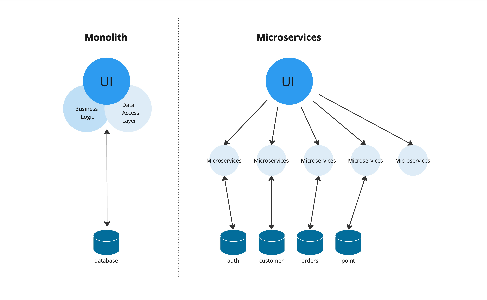

# ทำไมต้องใช้ Golang (Go Programming Language)

## แนะนำ
Go หรือ Golang เป็นภาษาโปรแกรมแบบคอมไพล์ (Compiled Language) ที่พัฒนาโดย Google เพื่อสร้างซอฟต์แวร์ที่มีประสิทธิภาพสูง มีความปลอดภัย และง่ายต่อการบำรุงรักษา Google สร้าง Golang มาเพื่อแก้ปัญหา Code ที่ซับซ้อนในภาาษาอื่นๆ และ การจัดการ Memmory ที่ไม่ดี และยังเหมาะนำมาทำ Microservices ด้วยเพราะด้วยความง่ายและขนาดที่เล็ก

Monolith VS Microservices

     

## จุดเด่นของ Go

### 1. **ประสิทธิภาพสูง (High Performance)**
   - Go เป็นภาษาแบบคอมไพล์ ทำให้การทำงานรวดเร็วโดยรันได้ในรูปแบบ Binary ทำให้ใช้ทรัพยากรได้อย่างมีประสิทธิภาพ
   - มีระบบ Garbage Collection ช่วยลดปัญหาการจัดการหน่วยความจำโดยที่เราไม่ต้องมาทำเอง

### 2. **สนับสนุนการทำงานพร้อมกัน (Concurrency)**
   - Go มีระบบ **Goroutines** ช่วยในการทำงานพร้อมกันได้ง่ายและมีประสิทธิภาพสูง

### 3. **ง่ายต่อการอ่านและบำรุงรักษา**
   - โครงสร้างของ Go มุ่งเน้นให้โค้ดอ่านง่าย มีไวยากรณ์ที่เรียบง่าย และบังคับให้ใช้งาน **Code Formatting** แบบเดียวกัน ทำให้โค้ดดูแลรักษาได้ง่าย
   - มีระบบจัดการ Dependency Management ที่เป็นระเบียบ ช่วยจัดการ package และ library ได้ดี

### 4. **คอมมูนิตี้ที่เติบโตอย่างรวดเร็ว**
   - ยิ่งคอมมูนิตี้ใหญ่เราก็ยิ่งหาข้อมูลได้ง่าย

## สรุป
Go เป็นภาษาที่มีประสิทธิภาพและความเรียบง่าย ช่วยลดข้อผิดพลาดในการพัฒนา ใช้งานในงานที่หลากหลายตั้งแต่แอปพลิเคชันขนาดเล็กไปจนถึงระบบที่ต้องการความทนทานสูง หากคุณต้องการพัฒนาซอฟต์แวร์ที่มีความรวดเร็ว ทนทาน และง่ายต่อการบำรุงรักษา Go เป็นภาษาที่ตามหาอยู่แน่นอน

