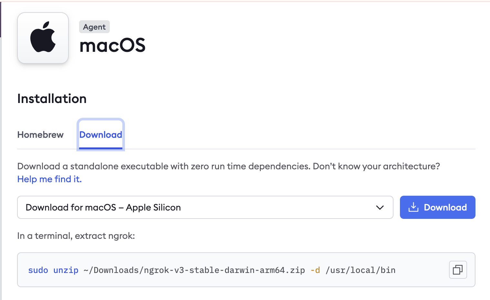

# วิธีติดตั้ง ngrok

### สำหรับ Windows

1. ***เข้าสู่เว็บไซต์ ngrok***
   - เปิดเว็บเบราว์เซอร์และไปที่ https://ngrok.com

2. ***สมัครสมาชิกหรือเข้าสู่ระบบ***
   - หากยังไม่มีบัญชี ให้คลิกที่ปุ่ม "Sign up" เพื่อสร้างบัญชีใหม่

3. ***ดาวน์โหลด ngrok สำหรับ Windows***
   - หลังจากเข้าสู่ระบบ ไปที่หน้า [download](https://download.ngrok.com/)
   - คลิกปุ่มดาวน์โหลดเพื่อดาวน์โหลดไฟล์ ZIP

4. ***แตกไฟล์ ZIP***
   - ไปที่โฟลเดอร์ที่ดาวน์โหลดไฟล์มา
   - คลิกขวาที่ไฟล์ ZIP และเลือก "Extract All..."

5. ***ย้ายไฟล์ ngrok.exe***
   - ย้ายไฟล์ ngrok.exe ไปยังโฟลเดอร์ที่คุณต้องการ เช่น C:\ngrok

6. ***เพิ่ม ngrok ใน PATH (เพื่อให้ใช้งานได้ทุกที่)***
   - เปิด Control Panel > System and Security > System
   - คลิกที่ Advanced system settings ด้านซ้าย
   - นแท็บ Advanced คลิก Environment Variables
   - ในส่วน System variables เลือกตัวแปร Path แล้วคลิก Edit
   - คลิก New และพิมพ์ที่อยู่โฟลเดอร์ที่เก็บไฟล์ ngrok.exe `C:\ngrok`
   - คลิก OK เพื่อบันทึกการเปลี่ยนแปลง

7. ***รับ Authtoken ของคุณ***
   - ไปที่หน้า [Your Authtoken](https://dashboard.ngrok.com/get-started/your-authtoken)
   - คัดลอก Authtoken ที่ปรากฏ

8. ***ติดตั้ง Authtoken ใน ngrok***
   - เปิด Command Prompt
        - กด Win + R พิมพ์ cmd แล้วกด Enter
   - รันคำสั่งต่อไปนี้:
        ```bash
        ngrok config add-authtoken YOUR_AUTHTOKEN
        ```
   - แทนที่ YOUR_AUTHTOKEN ด้วย Authtoken ที่คุณคัดลอกมา
9. ***ทดสอบการใช้งาน ngrok***
   - รันคำสั่ง:
        ```bash
        ngrok http 80
        ```
   - ระบบจะสร้าง URL ชั่วคราวสำหรับการเข้าถึงพอร์ต 80 ของเครื่องคุณ

#

### สำหรับ Mac

1. ***เข้าสู่เว็บไซต์ ngrok***
   - เปิดเว็บเบราว์เซอร์และไปที่ https://ngrok.com

2. ***สมัครสมาชิกหรือเข้าสู่ระบบ***
   - หากยังไม่มีบัญชี ให้คลิกที่ปุ่ม "Sign up" เพื่อสร้างบัญชีใหม่

3. ***ดาวน์โหลด ngrok สำหรับ Mac***
   - หลังจากเข้าสู่ระบบ ไปที่หน้า [download](https://download.ngrok.com/)
   - คลิกปุ่มดาวน์โหลดเพื่อดาวน์โหลดไฟล์

4. ***แตกไฟล์***
    <p align="center" width="100%">
         
    </p>
   - sudo unzip ~/Downloads/ngrok-v3-stable-darwin-arm64.zip -d /usr/local/bin แต่ละเครื่องจะไม่เหมือนกัน copy จาก web ดีที่สุด

5. ***ตั้งค่าสิทธิ์การใช้งาน***
   - รันคำสั่ง:
        ```bash
        sudo chmod +x /usr/local/bin/ngrok
        ```
6. ***รับ Authtoken ของคุณ***
   - ไปที่หน้า [Your Authtoken](https://dashboard.ngrok.com/get-started/your-authtoken)
   - คัดลอก Authtoken ที่ปรากฏ

7. ***ติดตั้ง Authtoken ใน ngrok***
   - ใน Terminal รันคำสั่ง:
        ```bash
        ngrok config add-authtoken YOUR_AUTHTOKEN
        ```
   - แทนที่ YOUR_AUTHTOKEN ด้วย Authtoken ที่คุณคัดลอกมา
8.  ***ทดสอบการใช้งาน ngrok***
   - รันคำสั่ง:
        ```bash
        ngrok http 80
        ```
   - ระบบจะสร้าง URL ชั่วคราวสำหรับการเข้าถึงพอร์ต 80 ของเครื่องคุณ

#

### หมายเหตุเพิ่มเติม
 - หยุดการทำงานของ ngrok: กด `Ctrl + C` ใน Command Prompt หรือ Terminal
