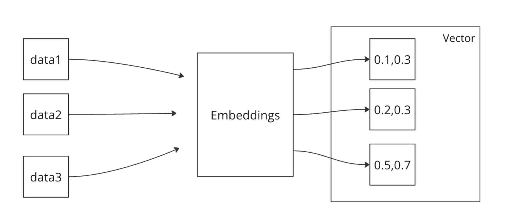
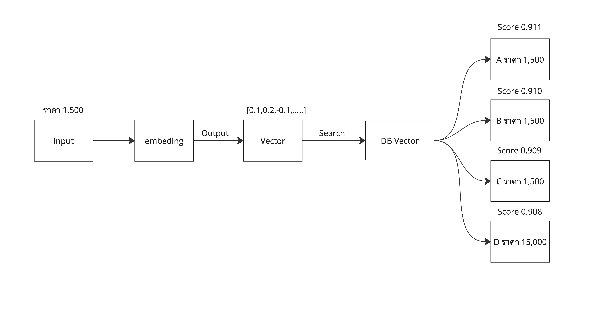
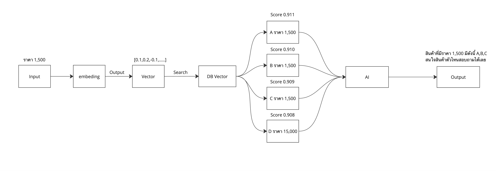

# Introduction RAG + AI

**Embedding** คือเทคนิคการแปลงข้อมูลในรูปแบบต่างๆ ไม่ว่าจะเป็นคำ, ประโยค, รูปภาพ หรืออื่นๆ ให้กลายเป็นตัวเลขที่คอมพิวเตอร์สามารถเข้าใจได้ง่ายขึ้น โดยข้อมูลที่แปลงออกมามักจะอยู่ในรูปแบบของ **Vector** ซึ่งเป็นชุดของตัวเลขที่มีขนาดและทิศทางที่แน่นอน

     

## ทำไมต้องใช้ Embedding?

Embedding มีความสำคัญในการช่วยลดขนาดของข้อมูล ทำให้สามารถใช้งานได้ง่ายขึ้นในหลากหลายแอปพลิเคชัน และทำให้สามารถจับความหมายเชิงความสัมพันธ์ระหว่างข้อมูลได้ เช่น คำที่มีความหมายใกล้เคียงกันจะมี Vector ที่มีค่าใกล้เคียงกัน ส่งผลให้สามารถนำไปใช้ในระบบต่างๆ ได้อย่างมีประสิทธิภาพมากขึ้น

## ตัวอย่างการทำงานของ Embedding

สมมติว่าคุณมีคำสามคำคือ "แมว", "หมา", และ "ปลา" การใช้ Embedding จะทำการแปลงคำเหล่านี้ให้เป็น **Vector** ตัวเลข เช่น:

- แมว -> [0.1, 0.3]
- หมา -> [0.2, 0.3]
- ปลา -> [0.5, 0.7]

จากตัวอย่างจะเห็นได้ว่า "แมว" และ "หมา" มี Vector ที่ใกล้เคียงกัน เพราะความหมายของคำทั้งสองมีความใกล้เคียงกัน ในขณะที่ "ปลา" มี Vector ที่ห่างออกไป เนื่องจากความหมายของมันต่างออกไป

## ข้อดีของการใช้ Embedding

1. **ลดขนาดข้อมูล:** Embedding ทำให้ข้อมูลที่ซับซ้อน เช่น คำหรือรูปภาพขนาดใหญ่ แปลงให้อยู่ในรูปแบบของ Vector ที่มีขนาดเล็กลง ทำให้ประหยัดพื้นที่ในการจัดเก็บและประมวลผลได้ง่ายขึ้น
2. **ความเข้าใจเชิงความหมาย:** Embedding ช่วยให้คอมพิวเตอร์เข้าใจความสัมพันธ์ระหว่างข้อมูลได้ดียิ่งขึ้น เช่น คำที่มีความหมายใกล้เคียงกันจะมี Vector ที่ใกล้เคียงกัน
3. **ประมวลผลง่ายขึ้นใน Machine Learning:** Embedding ทำให้ข้อมูลที่ได้สามารถนำไปใช้ในงานต่างๆ เช่น การวิเคราะห์ข้อความ (Text Analysis), การแนะนำสินค้า (Product Recommendation), หรือการรู้จำภาพ (Image Recognition) ได้อย่างมีประสิทธิภาพ

## การใช้งาน Embedding ในระบบ Bot

Embedding มีบทบาทสำคัญในการพัฒนาระบบ Bot หรือ AI ที่ต้องการความแม่นยำในการตอบคำถาม เมื่อนำคำถามเข้าสู่ระบบที่ใช้ Embedding ระบบจะสามารถจับคู่คำตอบที่มีความสัมพันธ์ใกล้เคียงกับคำถามได้ ทำให้การตอบคำถามแม่นยำและเป็นธรรมชาติมากขึ้น

## RAG (Retrieval-Augmented Generation) + AI (Artificial Intelligence)##

**(Retrieval-Augmented Generation)** ก็คือการรวบรวมข้อมูลจากที่ต่างๆในรูปแบบ Vector เพื่อให้ได้ข้อมูลที่ใกล้เคียงกับคำถามของผู้ใช้งาน

     

**AI (Artificial Intelligence)** คือปัญญาประดิษฐ์ ที่มีการเรียนรู้ การตัดสินใจ การวิเคราะห์ ตอบสนองสิ่งต่างๆ โดยไม่พึ่งมนุษย์ AI แบ่งออกเป็นหลายประเภท

1. AI ที่อิงกฎเกณฑ์ (Rule-Based AI): AI แบบนี้จะทำงานตามกฎเกณฑ์ที่มนุษย์กำหนดให้ เช่น ระบบที่ใช้ในการจัดการปัญหาโดยอิงจากคำสั่งที่เขียนขึ้นมา
2. Machine Learning (การเรียนรู้ของเครื่อง): เป็นส่วนหนึ่งของ AI ที่สามารถเรียนรู้จากข้อมูลที่ป้อนเข้าไปได้ และปรับปรุงประสิทธิภาพการทำงานตามข้อมูลที่ได้เรียนรู้ เช่น การรู้จำรูปภาพ, การวิเคราะห์ข้อมูล
3. Deep Learning (การเรียนรู้เชิงลึก): เป็นส่วนหนึ่งของ Machine Learning ที่ใช้เครือข่ายประสาทเทียม (Neural Networks) ที่มีโครงสร้างซับซ้อน เช่น การรู้จำเสียง, การแปลภาษาอัตโนมัติ
4. Natural Language Processing (NLP): AI ที่ทำงานกับการเข้าใจภาษามนุษย์ เช่น การประมวลผลภาษา การตอบข้อความ การทำ Chatbot

**OpenAI คือบริษัทที่พัฒนา AI ที่เรารู้จักในชื่อ CHAT GPT** 

     

#
***Completion API***
เป็น API ที่ให้บริการโดย OpenAI ซึ่งช่วยให้คุณสามารถสร้างข้อความต่อจากข้อความนำ (prompt) แต่เป็น Stateless มันคืออะไรมันก็คือไม่เก็บ Process ระหว่างการทำงาน
[อ่านเพิ่มเติม](https://platform.openai.com/docs/guides/text-generation)

#
***Embedding API***
ใช้ text-embedding-3-small,text-embedding-3-large,text-embedding-ada-002 model สำหรับการทำ Vector โดยความแม่นยำขึ้นอยู่กับขนาด model
[อ่านเพิ่มเติม](https://platform.openai.com/docs/guides/embeddings)

#
***Audio Transcription API***
ใช้ Whisper model จะเป็นแปลงจากเสียงเราไปเป็น TEXT
[อ่านเพิ่มเติม](https://platform.openai.com/docs/api-reference/audio/createTranscription)

#
***Audio Speech API***
ใช้ TTS model แปลงจากข้อความเป็นเสียง
[อ่านเพิ่มเติม](https://platform.openai.com/docs/guides/text-to-speech?lang=curl)

#
***Image Generation API***
ใช้  DALL·E 3 , DALL·E 2 model สำหรับแปลงข้อความไปเป็นรูปภาพ
[อ่านเพิ่มเติม](https://platform.openai.com/docs/guides/images)

#
***Assistant API***
เป็น API ที่ต่อยอดมาจากตัว  Completion API แต่จะเป็นแบบ Stateful ก็คือมันจะเก็บข้อมูลเพื่อให้สามารถอ้างอิงถึงได้ทำให้เราไม่ต้องส่งแชทก่อนหน้าไป
[อ่านเพิ่มเติม](https://platform.openai.com/docs/assistants/overview)

#
***Realtime API***

Realtime API เป็นอินเทอร์เฟซ WebSocket ฝั่งเซิร์ฟเวอร์ที่อยู่ในสถานะ Beta จาก OpenAI ที่ช่วยให้นักพัฒนาสร้างประสบการณ์การสนทนาที่มีความหน่วงต่ำและรองรับหลายรูปแบบสื่อ (มัลติโมดัล) API นี้รองรับทั้งข้อความและเสียงเป็นทั้งอินพุตและเอาต์พุต รวมถึงการเรียกใช้ฟังก์ชัน (Function Calling)

***ประโยชน์ที่สำคัญ:***

1. การแปลงเสียงเป็นเสียงโดยตรง: ลดความหน่วงเวลาและให้ผลลัพธ์ที่ละเอียดอ่อน
2. เสียงที่เป็นธรรมชาติและปรับแต่งได้: โมเดลสามารถปรับเสียงให้มีการแสดงอารมณ์ เช่น หัวเราะหรือกระซิบ และปรับตามโทนที่ต้องการ
3. เอาต์พุตหลายรูปแบบพร้อมกัน: ข้อความช่วยในการกลั่นกรอง ขณะที่เสียงที่เร็วกว่าเวลาจริงช่วยให้การเล่นกลับมีความเสถียร

[อ่านเพิ่มเติม](https://platform.openai.com/docs/guides/realtime)

#
เมื่อเรานำ **RAG (Retrieval-Augmented Generation) และ AI (Artificial Intelligence)** มาทำงานร่วมกัน จะได้ระบบที่มีความสามารถในการดึงข้อมูลที่เกี่ยวข้องกับคำถามที่ผู้ใช้ถาม และสร้างคำตอบที่มีความหมายอย่างแม่นยำและสมเหตุสมผลขึ้น โดย RAG ทำหน้าที่ดึงข้อมูลที่มีความเกี่ยวข้องสูงจากฐานข้อมูลที่ถูกแปลงเป็นเวกเตอร์ (Embedding) ส่วน AI จะนำข้อมูลเหล่านั้นมาแปรผลและตอบคำถามด้วยการเรียนรู้จากข้อมูลที่เคยถูกฝึกมา

     

